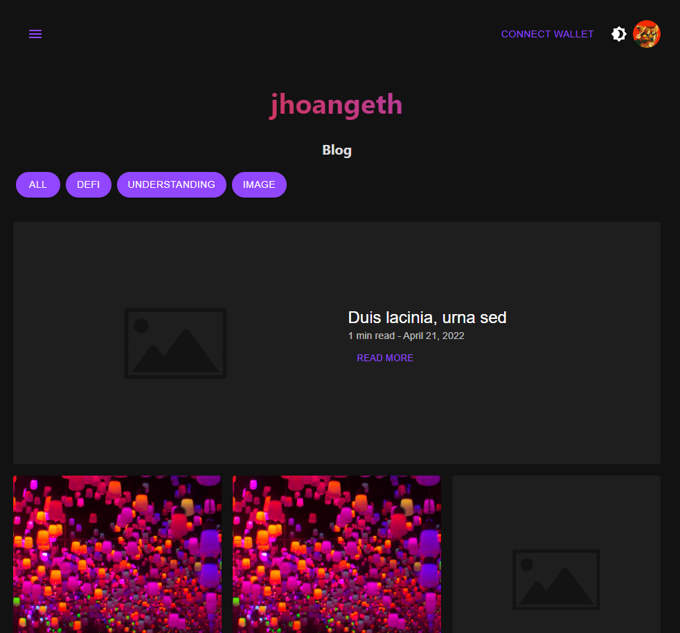

# WEb3 Blog

A responsive full stack web3 personal blog. Features include dark mode, filtering by tags, pagination, and sorting. Smart contract deployed on Mumbai Testnet. Only the owner of the smart contract can create blog posts. 

web3-blog-beta.vercel.app

## Technologies 
- Next.js
- Solidity
- Graphql
- The Graph
- IPFS
- Hardhat
- Ethersjs
- Chai
- Markdown 
- web3modal 
- Mui
  
## Setup 
1. Clone the repo 

```sh
git clone https://github.com/jhoan2/web3-blog.git
```

2. Install the dependencies

```sh
npm install

# or

yarn
```

3. Start the local test node

```sh
npx hardhat node
```

4. Deploy the contract

```sh
npx hardhat run scripts/deploy.js --network localhost
```

6. Run the app

```sh
npm start
```


